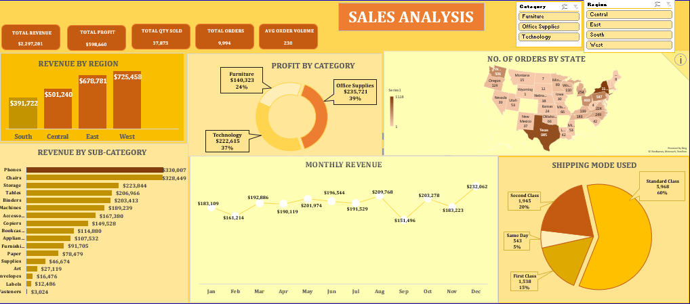
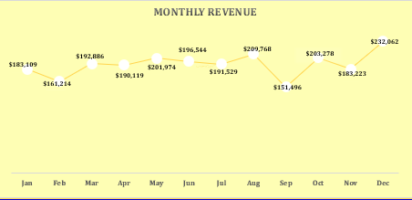
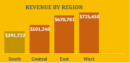
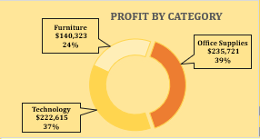

### Sales Analysis

---
### Table of Contents
1. [Objective](#objective)
2. [Problem Statement](#problem-statement)
3. [Tool](#tool)
4. [Skills Demonstrated](#skills-demonstrated)
5. [Visualizations](#visualizations)
6. [Findings](#findings)
7. [Recommendations](#recommendations)

---
### Objective
The goal of this project involves analyzing sales data to provide insights into the business's revenue, profitability, and operational efficiency. The goal is to enable data-driven decision-making by presenting actionable insights from the sales data.

### Problem Statement
This project aims to solve the challenges faced in a business by  answering some questions and also delivering an interactive and insightful dashboard.
1. Which region is generating the most revenue?		
2. Which Product category is the most profitable?		
3. What is sales trend like?		
4. What is the number of orders in each state?		
5. What is the most used shipping mode?		
6. Which segment patronises the most?	
7. which product sub-category generates the most revenue?

---
### Tool
- Excel

---
### Skills Demonstrated
- Cleaning
- Formatting
- organizing 
- transforming raw sales data 
- Critical Thinking
- Reporting

---
### Visualizations
The dashboard visualizes key metrics such as total revenue, profit, number of orders, and quantity sold. Additionally, it provides a breakdown visual of monthly revenue, revenue by region and profit by category.

**Dashboard**

**Monthly Revenue**

**Revenue by Region**

**Profit Category**

---
### Findings
**1. Which region is generating the most revenue?**

The **West** generates the highest revenue with **$725,458**, followed by the **East** with **$678,781**. The **South region** has the lowest revenue at **$391,722**. This indicates that targeted strategies might be needed to improve revenue in underperforming regions like the South.

**2. Which product category is the most profitable?**

The **Office Supplies** category is the most profitable, contributing *39%* of the total profit, followed by **Technology** at *37%*. **Furniture**, despite having significant revenue, contributes only *24%* to profits, suggesting higher costs or lower margins in this category.

**3. What is the sales trend like?**

Monthly sales show a fluctuation, with peaks in **December ($232,062) and August ($209,768)**. This indicates possible seasonal trends or promotional impacts during these months. Strategies to sustain sales during low months like **September ($151,496) and February ($161,214)** can be considered.

**4. What is the number of orders in each state?**

The state with the highest number of orders is **California (2001 orders)**, while some states have significantly fewer orders. This suggests high customer density or strong brand presence in California. Efforts to expand reach in underperforming states could boost overall sales.

**5. What is the most used shipping mode?**

The **Standard Class** shipping mode is used the most, accounting for *60%* of all shipments. "Second Class" and "First Class" follow at *24%* and *15%*, respectively. "Same Day" shipping accounts for only *5%*, possibly due to higher costs or limited demand.

**6. Which segment patronizes the most?**

From the data, it can be inferred that the Consumer segment dominates patronage. Additional data on segment-wise sales is required for more precise insights.

**7. Which product sub-category generates the most revenue?**

**Phones** is the top revenue-generating sub-category with **$330,007**, followed by **Chairs ($223,844)**. These items should be prioritized in marketing and inventory planning.

---
### Recommendations

**1. Regional Strategies:** Focus on improving sales in the South region through targeted marketing campaigns or partnerships.

**2. Profit Optimization:** Re-evaluate pricing or cost structures in the Furniture category to improve profitability.

**3. Seasonal Promotions:** Plan strategic sales and promotions during low months to sustain revenue throughout the year.

**4. State Expansion:** Increase presence in states with low orders through localized advertising and distribution.

**5. Shipping Options:** Promote faster shipping modes like "Same Day" to appeal to time-sensitive customers.

**6. Consumer Engagement:** Strengthen loyalty programs for the Consumer segment to maintain high patronage.

**7. Product Prioritization:** Allocate more resources to high-revenue sub-categories like Phones and Chairs for maximum impact.

